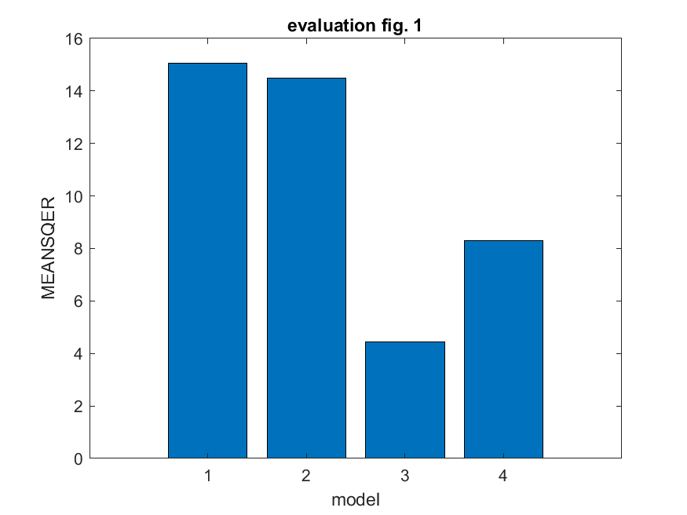
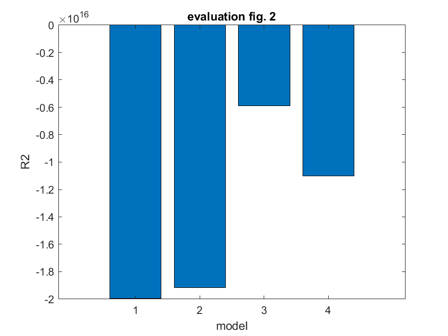
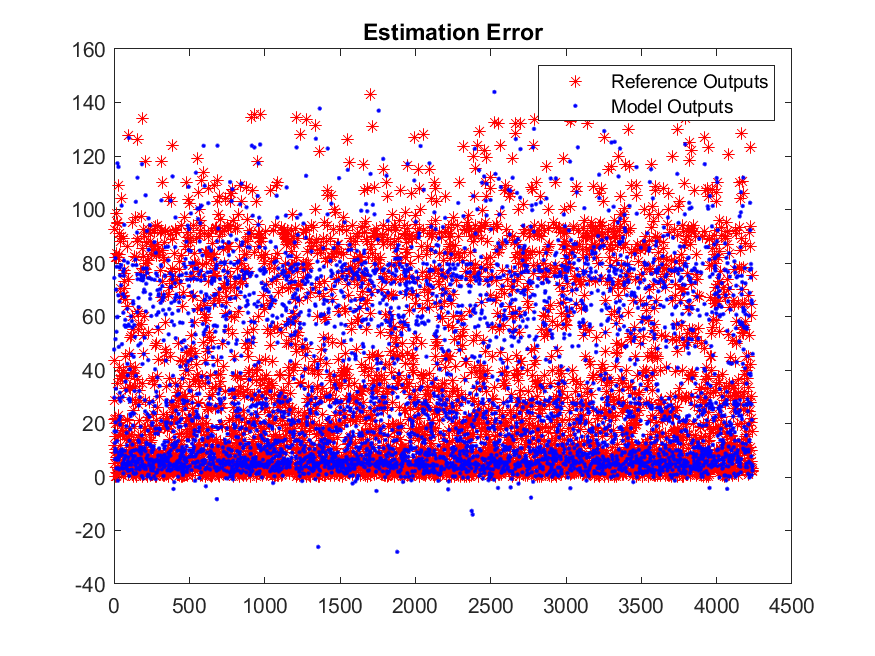
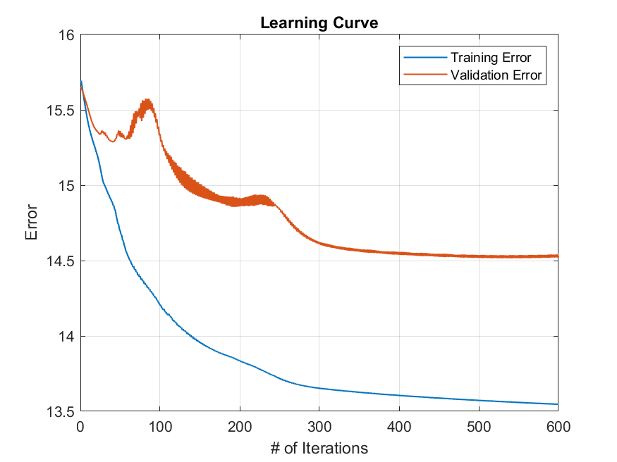
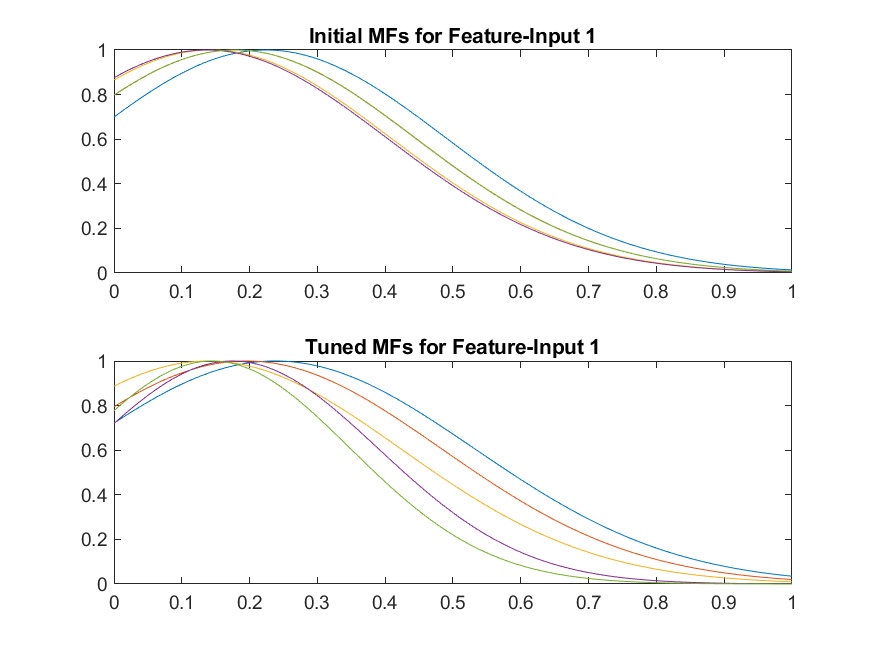
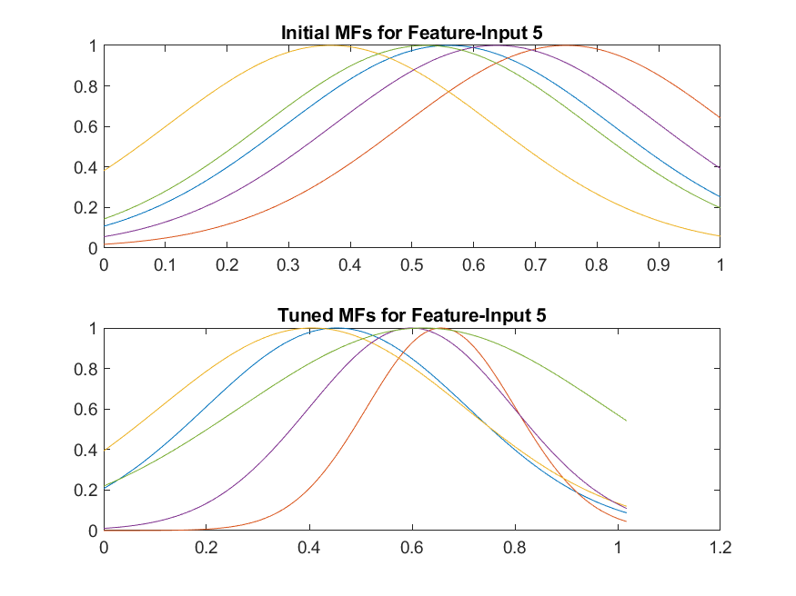

# Project 3 — Regression with ANFIS / TSK Fuzzy Modeling

[]()
[]()
[]()
[]()

This repository implements **regression modeling** using  
**ANFIS (Adaptive Neuro-Fuzzy Inference System)** and  
**Takagi–Sugeno–Kang (TSK) fuzzy inference systems**.

Multiple models are trained under different feature subsets and clustering radii.  
The goal is to approximate the aerodynamic *airfoil self-noise function* and evaluate model generalization performance.

---

## Project Overview

This project includes:

- Data preprocessing & normalization  
- Construction of multiple candidate TSK/ANFIS models  
- Parameter sweeps (features, clustering radii, membership functions)  
- Error analysis and model selection  
- Final optimized model with visualizations  

The implementation is fully reproducible in MATLAB.

---

## Folder Structure

```
/
├── docs/
│ ├── final_metrics.txt
│ ├── formula-MAE-MSE-RMSE-RSquared.JPG
│ ├── formulas.png
│ ├── mdl1.png
│ ├── mdl2.png
│ └── mdl3.png
│
├── figures/
│ ├── model1/
│ ├── model2/
│ ├── model3/
│ ├── model4/
│ ├── modelCompMEANSQER.png
│ └── modelCompR2.png
│
├── final_figures/
│ ├── Instances.png
│ ├── Learningcurve.png
│ ├── Model_Final_CompMfs_1.png
│ ├── Model_Final_CompMfs_5.png
│ ├── Model_Final_CompMfs_10.png
│ ├── Model_Final_CompMfs_15.png
│ └── Model_Final_CompMfs_19.png
│
├── src/
│ ├── FinalModel.m
│ ├── RegressionA.m
│ ├── RegressionB.m
│ └── split_scale.m
│
└── README.md
```

---

## Dataset

The project uses the **Airfoil Self-Noise** dataset.

Operations performed:

- Train/Validation/Test split  
- Scaling using `split_scale.m`  
- Feature selection & clustering radius sweeps  

---

## Mathematical Formulations

All regression metrics are computed as follows:

## Mean Absolute Error (MAE)

$$
MAE = \frac{1}{N}\sum_{i=1}^{N} \left| y_i - \hat{y}_i \right|
$$

## Mean Squared Error (MSE)

$$
MSE = \frac{1}{N}\sum_{i=1}^{N} (y_i - \hat{y}_i)^2
$$

## Root Mean Squared Error (RMSE)

$$
RMSE = \sqrt{MSE}
$$

## Coefficient of Determination (R^2)

$$
R^2 = 1 - \frac{\sum_{i=1}^{N}(y_i - \hat{y}_i)^2}{\sum_{i=1}^{N}(y_i - \bar{y})^2}
$$

---

## Model Comparison

The following metrics are extracted from MATLAB (`docs/final_metrics.txt` and model outputs):

| Model | RMSE | MSE | R² | Notes |
|------|------|------|------|------|
| **Model 1** | 18.9764 | 360.1043 | ~0.40 | Small feature subset |
| **Model 2** | 18.2546 | 333.2322 | ~0.41 | Medium subset |
| **Model 3** | 16.8753 | 284.7764 | ~0.43 | Good performance |
| **Model 4** | **14.5560** | **211.8771** | **0.8253** | Best performing model |

### Auto-Generated Comparison Plots

**RMSE / MSE comparison**



**R² comparison**



---

## Final Model Outputs

The best model (Model 4) is visualized below.

### Training Instances  


### Learning Curve  


### Membership Functions  
Examples:  
  


(Additional plots available inside `final_figures/`.)

---

## Source Code Description

| File | Description |
|------|-------------|
| **RegressionA.m** | Sweeps feature sets + clustering radii (Model 1–2). |
| **RegressionB.m** | Sweeps additional configurations (Model 3–4). |
| **FinalModel.m** | Builds, trains, evaluates the selected optimal model. |
| **split_scale.m** | Data scaling utilities for the dataset partitions. |

---

## Reproducing the Results

### Add project to MATLAB path:

```matlab
addpath(genpath('.'))

### Run candidate models:

RegressionA
RegressionB

### Run the final optimized model:

FinalModel

All figures and metrics will be automatically generated.

## License

This repository is for academic and research use.
No license is applied unless specified otherwise.

## Author

Project completed by Ilias Korompilis

